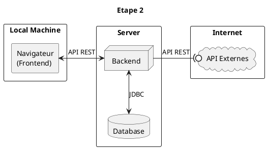

### Architecture macro

```plantuml
@startuml
'------------------------------------------------
'           Déclaration des objets
'------------------------------------------------
title Etape 1

' Etape 1
  rectangle "Server" as server1 {
    node "Frontend" as front1
  }
  rectangle "Local Machine" as client1 {
    rectangle "Navigateur" as browser1
  }

'------------------------------------------------
'                Interaction
'------------------------------------------------
' <-> double flèche horizontale
' <--> double flèche verticale
' Etape 1
browser1 <-> front1 : Client / Serveur

@enduml
```

Note:
Tout d'abord l'architecture Macro

**A l'étape 1**, le navigateur du client va se connecter via le protocol HTTP en mode client / serveur

Le serveur qui héberge le Frontend va répondre au client en téléchargeant le code du frontend en local sur le navigateur.
Ce code qui aura été transpilé de *Typescript/HTML/CSS* vers *Javascript/HTML/CSS* via Angular **pourra être interprété** par le navigateur.

**A l'étape 2**, en utilisant le code du Frontend, le navigateur va se connecter toujours via le protocol HTTP en mode client / serveur par l'intermédiaire d'une API REST au Backend.

Ce Backend qui est en code JAVA compilé, va se connecter, lorsque c'est nécessaire à la base de données via un driver JDBC (*Java DataBase Connectivity*) et aux API externes en utilisant le protocol HTTP toujours en mode client / serveur via une API REST

API REST (representational state transfer)
