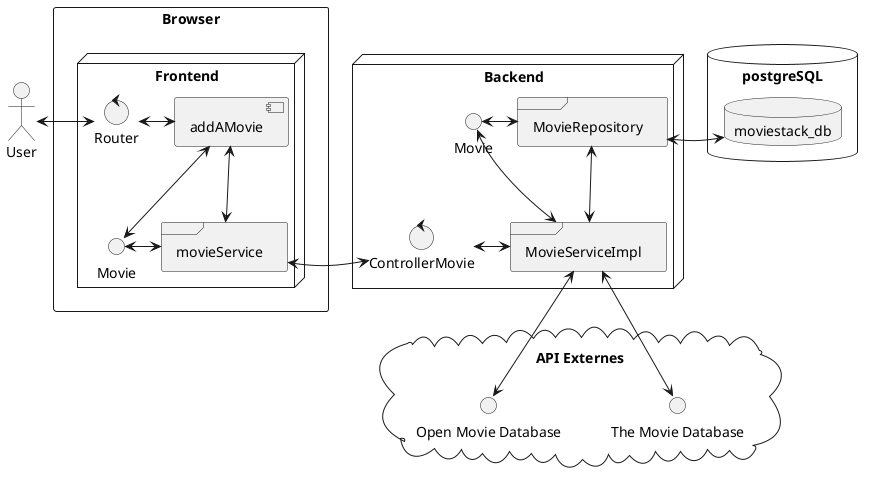

### Architecture séquentielle

Note:
Nous allons voir la séquence logicielle d'ajout d'un film

Le User charge la page d'ajout de film, ce qui va permettre d'afficher le composant `addAMovie` via le routeur.

Le User clique sur le bouton **ajouter un film** de la page d'ajout de film. Ce qui active **dans** le composant `addAMovie`, l'instanciation d'un nouvel object `Movie`.

Ce nouveau `Movie` va être utilisé par le service `movieService` qui va faire une requête au backend via l'API pour l'ajouter à la base de données.

Cette requête passe par le controleur `ControllerMovie` pour être "traduite". Ce controleur va parser l'URL pour en reconnaitre un chemin.
Si ce chemin est valide, le controleur exécutera le service associé à cette requête.

Le service `MovieServiceImpl` va récupérer les informations sur des API externes puis, via le Repository `MovieRepository`, enregistrer, dans notre cas, l'objet `Movie` dans la base de données postgreSQL
(O)
