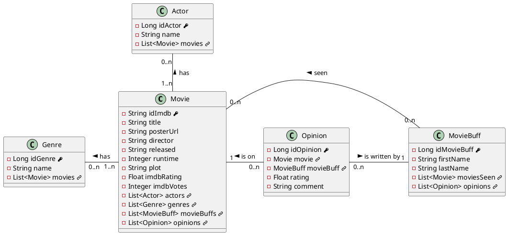

### Modèle Conceptuel de Données

Note:
Voici le modèle conceptuel de données.

On peut voir que chaque object à une interaction avec un ou plusieurs autres. 

Par exemple :

- un Film peut avoir 1 à plusieurs Genre mais un Genre ne peut pas "exister" sans Film.
- *idem pour les Acteurs.*
- Une Opinion est sur 1 Film et est écrite par 1 Cinéphile
- Un Film peut avoir aucune à plusieurs Opinion
- *idem pour les Cinéphiles*

Des clés primaires ont été choisies afin de ne pas avoir de doublons dans nos tables. (O)
